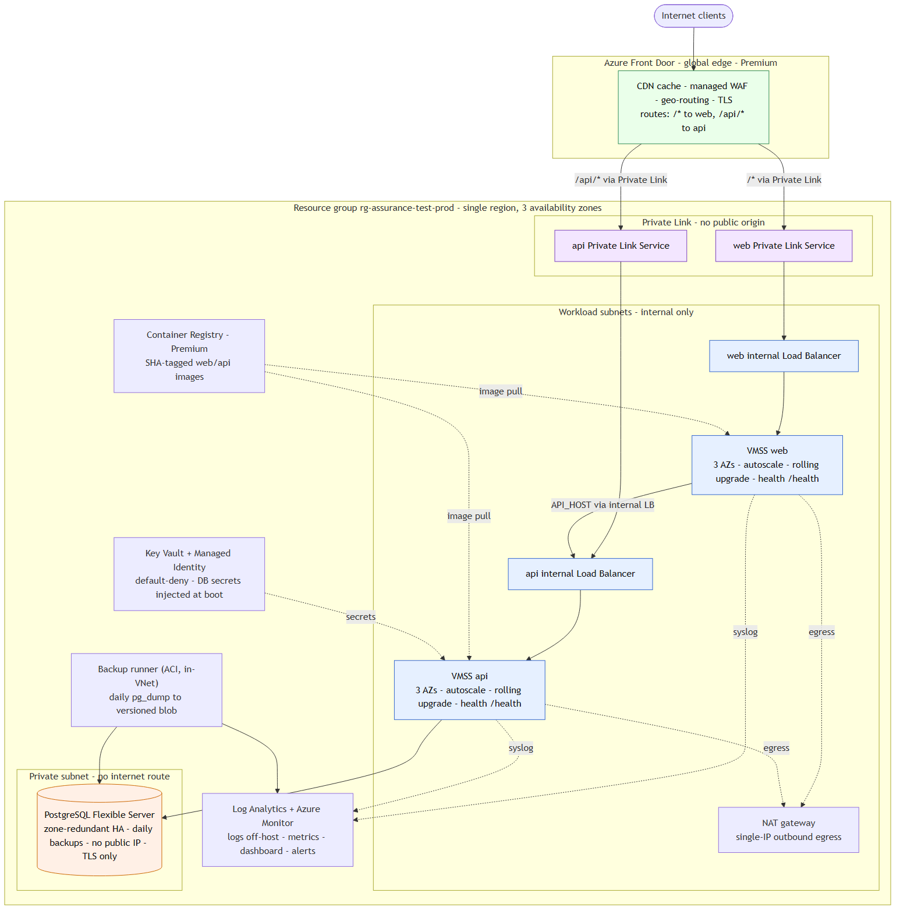

# assurance-test platform

Continuous delivery for a scalable, secure three-tier Node.js application on Azure,
provisioned end-to-end with Terraform and deployed by an automated pipeline.

```
Internet -> Azure Front Door (CDN, WAF, geo) -> web tier (VMSS) -> api tier (VMSS) -> PostgreSQL (private)
```



## Architecture

| Concern | Implementation |
|---------|----------------|
| Web + API tiers, Internet-facing | Azure Front Door routes `/*` to the web tier and `/api/*` to the api tier, each on a VM Scale Set behind a Standard Load Balancer across two availability zones |
| Database, private | Azure Database for PostgreSQL Flexible Server, zone-redundant HA, no public endpoint, reachable only from the api and backup subnets |
| East-west (web -> api) | The api tier has a second, internal load balancer; the web tier calls it privately inside the VNet |
| Infrastructure as code | Terraform (`azurerm`), remote state in Azure Storage with native blob-lease locking, one resource group |
| Instance-failure resilience | VMSS health probes + Application Health Extension + automatic instance repair across 2 zones; zone-redundant DB failover |
| Zero-downtime deploys | Health-gated VMSS rolling upgrades; immutable, SHA-tagged container images in ACR |
| Automated deployment | GitHub Actions: lint/test -> build+push images -> `terraform apply` -> rolling upgrade -> smoke test |
| Daily backups | Flexible Server point-in-time restore (7 days) + an in-VNet `pg_dump` job to versioned blob storage |
| Centralized logs | Azure Monitor Agent ships container/syslog off-host to a Log Analytics workspace; all managed services send diagnostics there too |
| Historical metrics | Azure Monitor dashboard + alert rules (latency, CPU, DB load, cache-hit ratio) |
| CDN by client location | Azure Front Door global edge with caching for static assets |
| Secrets | Azure Key Vault + VMSS managed identity; no credentials on disk or in the repo |

## Requirement mapping

| Requirement | Where |
|-------------|-------|
| Web + API exposed to the Internet | `infra/modules/edge`, `infra/modules/compute` |
| DB not reachable from the Internet | `infra/modules/data` (private access), `infra/modules/network` (NSGs) |
| Fully provisioned via IaC | `infra/` |
| Handle instance failures | `infra/modules/compute` (VMSS, health, auto-repair), `infra/modules/data` (HA) |
| No-downtime updates | `infra/modules/compute` (rolling upgrade), `.github/workflows/deploy.yml` |
| Automated code deployment | `.github/workflows/` |
| Daily DB + storage backup | `infra/modules/data` (PITR), `infra/modules/backup`, `scripts/backup/` |
| Logs accessible off-host | `infra/modules/observability` (Log Analytics, DCR, diagnostics) |
| Historical metrics | `infra/modules/observability` (dashboard, alerts) |
| CDN by location | `infra/modules/edge` (Front Door) |
| Runtime start/stop/scale scripts | `scripts/runtime/` |

## Repository layout

```
app/                     forked application (web, api) + Dockerfiles + tests
infra/                   Terraform: root stack + modules (network, security, registry,
                         data, compute, edge, observability, backup)
scripts/bootstrap/       one-time state + OIDC setup
scripts/runtime/         start / stop / scale / restart / status
scripts/backup/          pg_dump / pg_restore + job image
scripts/smoke/           post-deploy smoke test
.github/workflows/       ci, deploy, mirror
diagram/                 architecture diagram
deploy-aks/              alternative: AKS + Helm
deploy-aca/              alternative: Azure Container Apps
```

## Quick start

```bash
# 1. one-time: resource group + Terraform state storage
LOCATION=eastus bash scripts/bootstrap/create-state.sh

# 2. provision + deploy
cd infra
export TF_VAR_ssh_public_key="$(cat ~/.ssh/id_rsa.pub)"   # RSA key (Azure requirement)
terraform init \
  -backend-config="resource_group_name=rg-assurance-test-prod" \
  -backend-config="storage_account_name=<state-account>"
terraform apply

# 3. verify
bash scripts/smoke/smoke-test.sh "$(terraform output -raw frontdoor_hostname)"
```

See `infra/README.md` for details and `scripts/` for day-2 operations. Alternative
deployment models are in `deploy-aks/` (Kubernetes + Helm) and `deploy-aca/`
(Azure Container Apps); the primary VMSS stack is the reference implementation.

## Runtime operations

```bash
scripts/runtime/status.sh                 # instances, health, model
scripts/runtime/scale.sh api 3            # scale a tier
scripts/runtime/restart.sh web            # rolling restart
```

## Teardown

```bash
cd infra && terraform destroy
az group delete -n rg-assurance-test-prod
```
