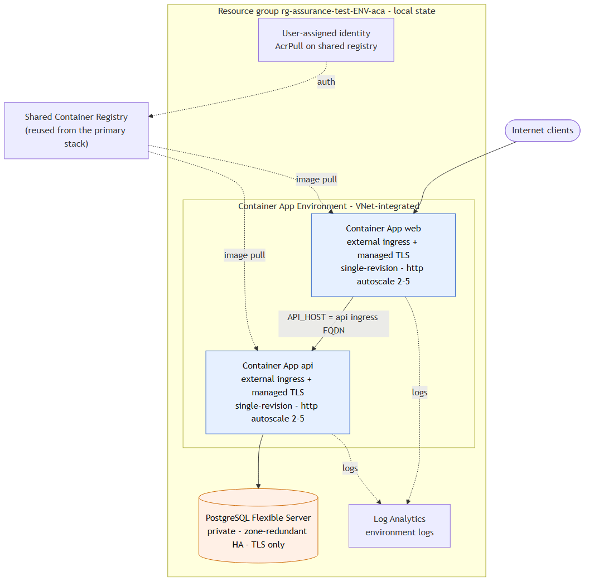

# Azure Container Apps alternative deployment

The same three-tier application on Azure Container Apps (serverless containers): web and
api run as Container Apps with external ingress + managed TLS, HTTP-based autoscaling, and
single-revision mode (new image = new revision, automatic zero-downtime shift). The
environment is VNet-integrated so it reaches a private, zone-redundant PostgreSQL Flexible
Server. Independent, deploy-on-demand alternative to the primary VMSS stack; reuses the
shared registry for images.

Note on naming: Azure Container Service (ACS) was retired and folded into AKS, so this is
the modern managed-container alternative alongside the AKS path.



Both apps pull from the shared registry with a user-assigned identity (`AcrPull`), run
external ingress with managed TLS, autoscale on HTTP concurrency (2-5 replicas), and
pass `DBSSL=require`. The environment is VNet-integrated (a delegated infrastructure
subnet) so it reaches the private database. Like the primary stack it is parameterised
by an `environment` variable (`rg-assurance-test-<env>-aca`, tags, DB SKU / HA toggle),
and `security.yml` scans this root alongside `infra` and `deploy-aks`.

## Deploy

```bash
ACR_NAME=$(terraform -chdir=../infra output -raw acr_name)
terraform init
terraform apply -auto-approve -var "acr_name=$ACR_NAME"
```

## Verify

```bash
WEB=$(terraform output -raw web_url)
API=$(terraform output -raw api_url)
curl -fsS "$WEB/health"
curl -fsS "$API/api/status"     # api -> private db
curl -fsS "$WEB/"               # web -> api -> db
```

Zero-downtime deploy of a new image tag (creates a new revision):

```bash
terraform apply -auto-approve -var "acr_name=$ACR_NAME" \
  -var "web_tag=<sha>" -var "api_tag=<sha>"
```

## Teardown

```bash
terraform destroy -auto-approve -var "acr_name=$ACR_NAME"
```

## Notes

- State is local here for simplicity; point `backend "azurerm"` at the shared state
  account with a distinct key to share across a team.
- Front Door can front the web/api ingress FQDNs for CDN + geo-routing, as in the primary.
