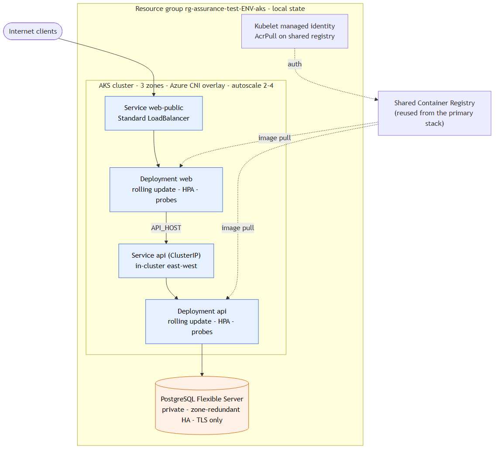

# AKS + Helm alternative deployment

The same three-tier application on Kubernetes: web and api run as Deployments with
rolling updates, health probes, HPA autoscaling, and zone spread; the api is exposed
in-cluster and the web tier via a Standard LoadBalancer service; PostgreSQL is a
private, zone-redundant Flexible Server. This is an independent, deploy-on-demand
alternative to the primary VMSS stack: its own resource group and state, reusing the
shared container registry for images.



The cluster runs Azure CNI overlay with a 3-zone autoscaling system pool (2-4 nodes),
a system-assigned identity granted `AcrPull` on the shared registry, and the OIDC
issuer enabled. The Helm release sets `disable_openapi_validation` (the manifests are
plain Deployments/Services and the schema download is unreliable on some networks) and
passes `DBSSL=require` because Flexible Server mandates TLS. Like the primary stack it
is parameterised by an `environment` variable, so the resource group name, tags, node
sizing, and the DB SKU / HA toggle are all environment-derived
(`rg-assurance-test-<env>-aks`). The `security.yml` workflow scans this root
(tfsec + Checkov) alongside `infra` and `deploy-aca`.

## Deploy

```bash
# ACR that already holds the images (from the primary stack)
ACR_NAME=$(terraform -chdir=../infra output -raw acr_name)

terraform init
terraform apply -auto-approve -var "acr_name=$ACR_NAME"
```

The apply provisions the cluster + private DB and installs the Helm chart.

## Verify

```bash
eval "$(terraform output -raw get_credentials_cmd)"
kubectl get pods -o wide          # pods spread across zones
kubectl get hpa                   # autoscalers
kubectl get svc web-public api-public   # public LoadBalancer IPs

WEB=$(kubectl get svc web-public -o jsonpath='{.status.loadBalancer.ingress[0].ip}')
curl -fsS "http://$WEB/health"
curl -fsS "http://$WEB/"          # web -> api -> db
```

Rolling, zero-downtime deploy of a new image tag:

```bash
terraform apply -auto-approve -var "acr_name=$ACR_NAME" \
  -var "web_tag=<sha>" -var "api_tag=<sha>"
kubectl rollout status deploy/web
```

## Teardown

```bash
terraform destroy -auto-approve -var "acr_name=$ACR_NAME"
```

## Notes

- State is local here for simplicity; point `backend "azurerm"` at the shared state
  account with a distinct key to share across a team.
- A Front Door profile can sit in front of the `web-public` / `api-public` services for
  CDN + geo-routing, identical to the primary stack.
